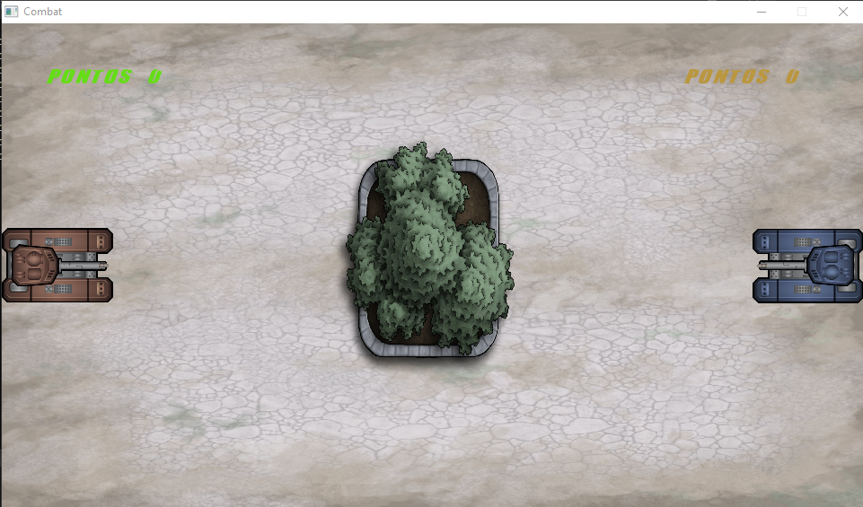
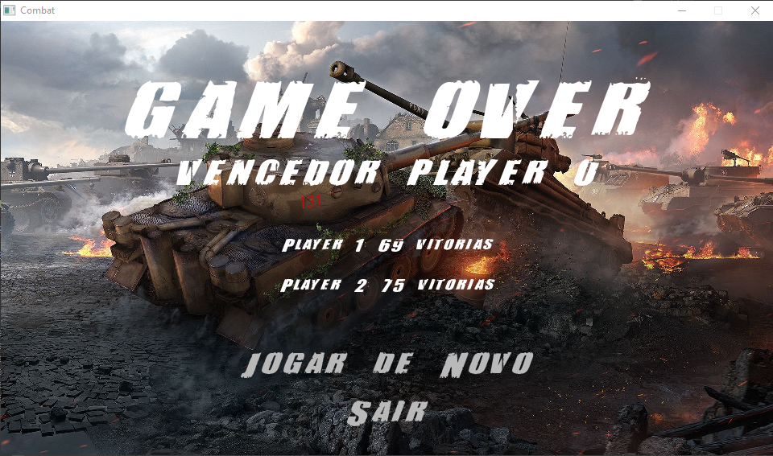

# Documentação do jogo 'Combat'


Autor: Flávio Marcilio de Oliveira

Professor: Pedro O. S. Vaz de Melo - PDSI





## Índice

- [Documentação do jogo 'Combat'](#documentação-do-jogo-combat)
  - [Índice](#índice)
  - [1. Introdução](#1-introdução)
  - [2. Manual de Uso](#2-manual-de-uso)
    - [2.1 O Jogo](#21-o-jogo)
    - [2.2 Como Jogar](#22-como-jogar)
      - [2.2.1 Jogador 1](#221-jogador-1)
      - [2.2.2 Jogador 2](#222-jogador-2)
  - [3. Implementação](#3-implementação)
    - [3.1 Estruturas de dados](#31-estruturas-de-dados)
    - [3.2 Funções e procedimentos](#32-funções-e-procedimentos)
      - [3.2.1 Cenário](#321-cenário)
      - [3.2.2 Menu](#322-menu)
      - [3.2.3 Tanques](#323-tanques)
      - [3.2.4 Tiro](#324-tiro)
      - [3.2.5 Colisões](#325-colisões)
      - [3.2.6 Pontuação](#326-pontuação)
      - [3.2.7 Obstáculo](#327-obstáculo)
      - [3.2.8 Histórico](#328-histórico)
      - [3.2.9 Inicialização](#329-inicialização)
      - [3.2.10 Programa Principal](#3210-programa-principal)

## 1. Introdução

Esta documentação tem o objetivo de explicar a implementação e o funcionamento do Trabalho Prático desenvolvido durante o curso de Programação e Desenvolvimento de Software 1 como uma forma de aplicar os conhecimentos adquiridos durante a disciplina. Neste trabalho, o aluno deve desenvolver um jogo semelhante ao clássico jogo *Combat* da Atari utilizando linguagem C e a biblioteca Allegro ([www.allegro.cc](https://www.allegro.cc/)). 

## 2. Manual de Uso

### 2.1 O Jogo

Este jogo foi desenvolvido baseado no jogo *Combat* do Atari 2600. O *Combat* foi um dos nove jogos de lançamento do Atari 2600 e o primeiro a ser criado para o console, nele os jogadores controlam veículos que devem se enfrentar em diversas arenas.

Nesse jogo, dois tanques inimigos estão em um campo de batalha que é visto de cima. Cada tanque é controlado por um jogador e o objetivo do jogador é eliminar o outro com disparos do canhão do tanque que ele controla. O combate termina quando um jogador consegue acertar o adversário cinco vezes.

Durante o combate, a partida pode ser pausada utilizando a tecla **ESC**. 

### 2.2 Como Jogar

#### 2.2.1 Jogador 1

> TECLA **W**: Movimenta o tanque 1 para frente;
> 
> TECLA **S**: Movimenta o tanque 1 para trás;
> 
> TECLA **D**: Rotaciona o tanque 1 no sentido horário;
> 
> TECLA **A**: Rotaciona o tanque 1 no sentido anti-horário;
> 
> TECLA **Q**: Atira com tanque 1;

#### 2.2.2 Jogador 2

> TECLA **UP**: Movimenta o tanque 2 para frente;
> 
> TECLA **DOWN**: Movimenta o tanque 2 para trás;
> 
> TECLA **RIGTH**: Rotaciona o tanque 2 no sentido horário;
> 
> TECLA **LEFT**: Rotaciona o tanque 2 no sentido anti-horário;
> 
> TECLA **ENTER**: Atira com tanque 2;

## 3. Implementação

### 3.1 Estruturas de dados

* `Ponto`: Define as coordenadas x e y de um ponto;
* `Tiro`: Define as propriedades do projétil;
* `Tanque`: Define as propriedades para os tanques;
* `Bloco`: Define as propriedades do obstáculo;
* `Botao`: Define as propriedade para a construção dos botões nas telas;

### 3.2 Funções e procedimentos

#### 3.2.1 Cenário

Procedimento para criar o plano de fundo onde os outros são desenhados.

```c
// Desenha a tela inicial que será a arena de combate.
void desenhaCenario() {...}

```

#### 3.2.2 Menu

Procedimentos para desenhar as opções do usuário nas telas de PAUSE e de GAMEOVER e permitir o controle através do mouse.

```c
// Faz o setup inicial para cada botão.
void initBotao(Botao *botao, int x, int y, int b_x, int b_y, ALLEGRO_FONT **fonte) {...}

// Verifica se o botão foi clicado.
void atualizaBotao(Botao *botao, int x, int y) {...}

// Desenha o botão na tela.
void desenhaBotao(Botao botao, char const *nome) {...}

```

#### 3.2.3 Tanques

Procedimentos para criar, desenhar e operar os tanques na tela.

```c
// Desenha o tanque na tela.
void desenhaTanque(Tanque t) {...}

// Rotaciona o ponto 'p' por um ângulo 'angle'.
void rotate(Ponto *p, float angle) {...}

// Faz o setup inicial para cada tanque.
void initTanque (Tanque *t, char const *imagem) {...}

// Rotaciona as coordenadas de definição do tanque.
void rotacionaTanque(Tanque *t) {...}

// Atualiza a posição do tanque.
void atualizaTanque(Tanque *t) {...}

```

#### 3.2.4 Tiro

Procedimentos para criar os projéteis, fazer o disparo e fazer a movimentação dos projéteis na tela.

```c
// Cria o efeito de um disparo do tanque.
void desenhaDisparo(Tiro tiro, Tanque tanque, int indice) {...}

// Desenha o projétil na tela.
void desenhaTiro(Tiro tiro, Tanque t) {...}

// Faz o setup inicial de cada projétil.
void initTiro(Tiro *tiro, Tanque t) {...}

// Atualiza a posição do projétil na tela.
void atualizaTiro(Tiro *tiro) {...}

// Executa a ação do disparo.
void disparo(Tanque tanque, Tiro *tiro) {...}

```

#### 3.2.5 Colisões

Procedimentos e funções para verificar as colisões durante o jogo e executar comandos específicos caso ocorra uma colisão entre os diferentes componentes do jogo.

```c
// Calcula a distância entre dois pontos.
float distPontos(Ponto p1, Ponto p2) {...}

// Verifica se ocorreu uma colisão entre um círculo e um retângulo.
int colisaoCirculoRetangulo(Ponto centro, float raio, Bloco bloco) {...}

// Verifica se ocorreu uma colisão entre os dois tanques. Caso tenha uma colisão, os tanques são impedidos de continuar a movimentação no sentido inicial.
void colisaoTanqueTanque(Tanque *tanque1, Tanque *tanque2) {...}

// Verifica se o projétil disparado pelo tanque de ataque acertou o tanque de defesa. Caso o defensor tenha sido atingido, o atacante ganha um ponto.
void colisaoTanqueTiro(Tanque *ataque, Tanque *defesa, Tiro *tiro) {...}

// Verifica se o tanque colidiu com o bloco através do procedimento 'colisaoCirculoRetangulo'. Caso tenha a colisão, o tanque é impedido de prosseguir no sentido do seu movimento.
void colisaoTanqueBloco(Tanque *tanque, Bloco *bloco) {...}

// Limita o movimento do tanque no espaço definido pela arena de jogo.
void colisaoTanqueTela(Tanque *tanque) {...}

// Verifica se o projétil ainda está na tela. Se o tiro saiu da tela o jogador é liberado para fazer novo disparo, caso contrário, o jogador não poder realizar novo disparo.
void colisaoTiroTela(Tiro *tiro) {...}

// Verifica se o projétil atingiu o obstáculo. Quando o tiro atinge o obstáculo, o jogador é liberado a realizar novo disparo.
void colisaoTiroBloco(Tiro *tiro, Bloco *bloco) {...}

```

#### 3.2.6 Pontuação

Procedimento para mostrar o placar do jogo na tela;

```c
// Desenha o placar na tela.
void sistemaPontuaco(ALLEGRO_FONT *font, Tanque *tanque) {...}

```

#### 3.2.7 Obstáculo

Procedimentos e funções para criar um obstáculo de tamanho aleatório na tela.

```c
// Gera um número aleatório entre 0 e 1.
float randf() {...}

// Gera números aleatórios necessários para criar diferentes obstáculos.
float randFloat(float min, float max) {...}

// Desenha o obstáculo na tela.
void desenhaBloco(Bloco b) {...}

// Faz o setup inicial para o obstáculo que será criado na tela.
void initBloco(Bloco *b) {...}

```

#### 3.2.8 Histórico

Função para armazenar o histórico das partidas.

```c
// Função que cria o histórico de partidas disputadas e armazena em um arquivo 'txt' após cada partida. Além disso, esta função retorna o ID do jogador vencedor para ser mostrado na tela após o fim da partida.
int atualizaRegistro(Tanque *tanque1, Tanque *tanque2) {...}

```

#### 3.2.9 Inicialização

Procedimento para separar as funções de inicialização do allegro.

```c
// Gera uma mensagem de erro caso algum procedimento de inicialização não tenha sucesso.
void error_msg(char *text) {...}

// Inicializa os módulos do Allegro necessários para o funcionamento do jogo.
int inicializar() {...}

```

#### 3.2.10 Programa Principal

No programa principal os objetos necessários para o jogo são instanciados, depois a função `inicializar` é chamada e, caso algum módulo não seja inicializado, o programa é interrompido. Após a inicialização de todos os módulos, os objetos são inicializados e o procedimento `al_start_timer(timer)` é chamado para inicializar o temporizador do jogo. A partida é organizada dentro do laço `while(!sair)` que é executado até o jogador acione o botão **SAIR** ou feche a janela.

```c
// Função principal que controla o desenvolvimento do jogo.
int main(int argc, char **argv) {

    { Instanciação dos objetos }

    if (!inicializar()) {
      return -1;
    }

    { Inicialização dos objetos }

    al_start_timer(timer);

    while(!sair) {
      ALLEGRO_EVENT ev;

      al_wait_for_event(event_queue, &ev);

      { eventos e chamadas das funções e procedimentos }
    }

    { desalocação de memória }
}

```